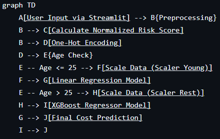
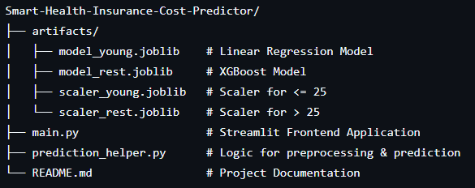

# Smart-Health-Insurance-Cost-Predictor 🏥💰

A robust Machine Learning web application designed to predict health insurance premiums based on user demographics, health history, and policy preferences.

## 🧠 Project Overview

The **Smart-Health-Insurance-Cost-Predictor** solves the challenge of non-linear pricing in insurance. Insurance costs often behave differently for young adults compared to older demographics due to risk factors. To address this, this project employs a **Hybrid Model Strategy**:

* **Young Demographic (≤ 25 years):** Uses **Linear Regression** (Standard Sklearn), as costs tend to scale linearly with specific factors in this bracket.
* **Rest Demographic (> 25 years):** Uses **XGBoost Regressor**, capable of capturing complex, non-linear relationships and interactions between age, BMI, and medical history.

## ⚙️ How It Works (Architecture)

The application processes user inputs, calculates a custom risk score, and routes the data to the specific model trained for that age group.


graph TD


## 🚀 Features

* **Dual-Model Engine:** Automatic switching between `model_young.joblib` and `model_rest.joblib` for optimized accuracy.
* **Custom Risk Calculation:** Computes a normalized risk score based on medical history (Diabetes, BP, Heart issues, etc.) and genetic factors.
* **Interactive UI:** Built with **Streamlit** for an easy-to-use form interface.
* **Smart Scaling:** Applies different `MinMaxScalers` depending on the age demographic to preserve data integrity.

## 🛠️ Technologies Used

* **Python:** Core logic.
* **Streamlit:** Web interface.
* **XGBoost:** Advanced Gradient Boosting for complex predictions.
* **Scikit-Learn:** Linear Regression and Preprocessing.
* **Joblib:** Model serialization.
* **Pandas:** Data manipulation.

## 📂 Project Structure

Smart-Health-Insurance-Cost-Predictor



## 🔧 Installation & Usage

1.  **Clone the Repository**
    ```bash
    git clone [https://github.com/yourusername/Smart-Health-Insurance-Cost-Predictor.git](https://github.com/yourusername/Smart-Health-Insurance-Cost-Predictor.git)
    cd Smart-Health-Insurance-Cost-Predictor
    ```

2.  **Install Dependencies**
    ```bash
    pip install pandas joblib scikit-learn xgboost streamlit
    ```

3.  **Run the Application**
    ```bash
    streamlit run main.py
    ```

4.  **Access the App**
    Open your browser and navigate to `http://localhost:8501`.

## 📊 Inputs Used for Prediction

The model takes the following parameters to calculate the premium:

* **Demographics:** Age, Gender, Marital Status, Region.
* **Economic:** Income (in Lakhs), Employment Status.
* **Health:** BMI Category, Smoking Status, Medical History, Genetical Risk.
* **Policy:** Insurance Plan (Bronze, Silver, Gold), Number of Dependants.
